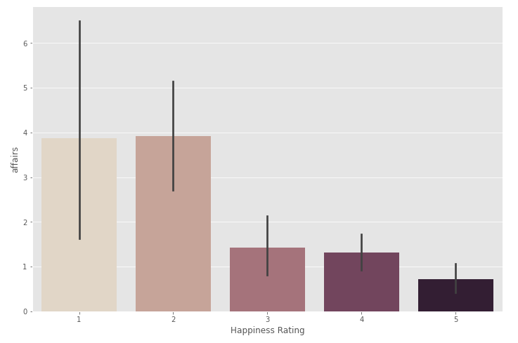
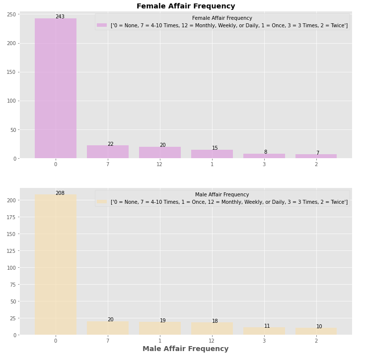
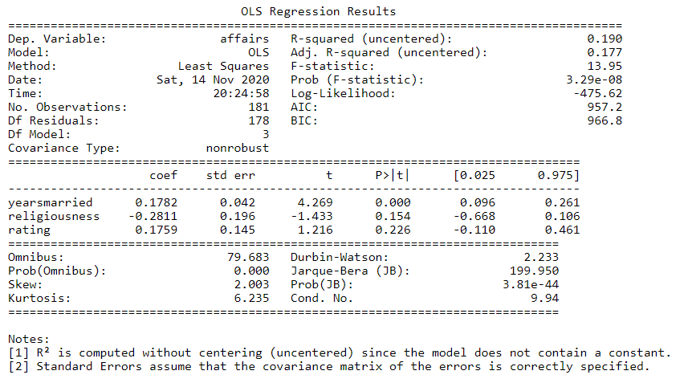

# Marital Infidelity
 

Couples therapists view extramarital affairs as one of the most damaging relationship events and 
one of the most difficult problems to treat in couples therapy. Furthermore, a review of 
ethnographic accounts of conjugal dissolution across 160 societies found that infidelity was the 
single most common cause of marital dissolution. Rather than seeking couple therapy when 
extramarital affairs happen, can we predict the factors of extramarital affairs? If so, we may help 
prevent marital affairs from happening. The aim of the current project is to determine the 
predictors of extramarital affairs. 

# Data Set
To tackle this project, I utilized Fair’s Affair data set. It 
featured `10 columns and 601 rows`. Some notable features were frequency of affairs, gender, age, 
years married, and religiousness. After running a correlation matrix, the significant predictors 
for my model were years married, religiousness, and happiness rating. 

# Marital Happiness and Infidelity

Happiness rating was categorized as 1 = very unhappy, 2 = somewhat 
unhappy, 3 = average, 4 = happier than average, and 5 = very happy. Looking at the bar plot, 
most affairs occurred with respondents whom answered in the 1 and 2 categories. The least 
affairs occurred with respondents in the 5 category. The mean for happiness rating was *M* = 3.93 
and a *SD* = 1.10.

# Affair by Sex

Affair by sex did not appear to be statistically significant between the sexes. Males had a 
mean of *M* = 1.50 affairs in the past year with a *SD* = 3.29. Females had a mean of *M* = 1.42 
affairs in the past year with a *SD* = 3.31. 

# Affair Frequency by Sex

How often the sexes engage in extramarital affairs during the past year varied 
between categories. However, overall, both sexes appeared to engage in extramarital affairs just about 
equally. 

# Training Regression Model

The predictors for my model were years married, 
religiousness, and happiness. My target variable was affairs. I used a split validation to partition 
the data set for my model. The training model utilized a data set with 417 instances while my test 
model used 178 instances. According to my model, the predictor for affairs is years married. It had a *p* value of *p* = 0.00. Surprisingly, happiness rating did not appear to have a 
statistically significant effect on my model. It had a *p* value of *p* = 0.95. The attribute 
religiousness did not appear to have a statistically significant effect neither. It had a *p* value of *p* 
= 0.75. 

# Test Model

In the testing model too, religiousness and happiness rating did not appear as significant 
predictors of infidelity. However, years of marriage did appear as a predictor. It had 
a *p* value of *p* = 0.00.  

#### GitHub Repository
[Link](https://github.com/RenaissanceMan06/Marital_Infidelity)
