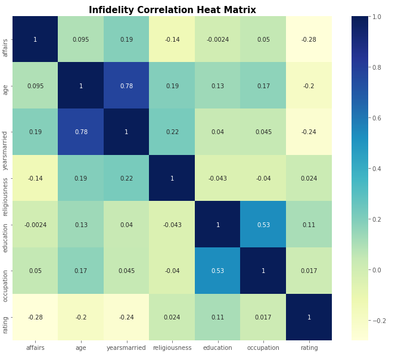
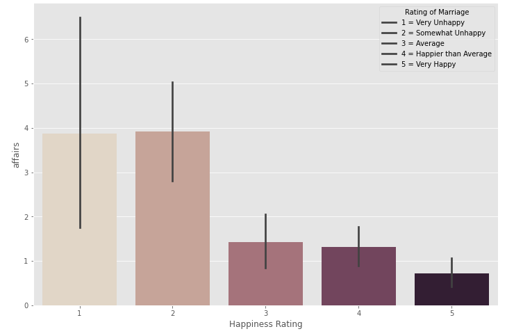
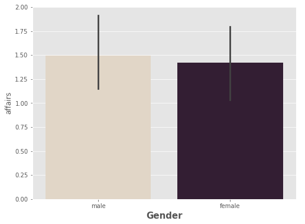
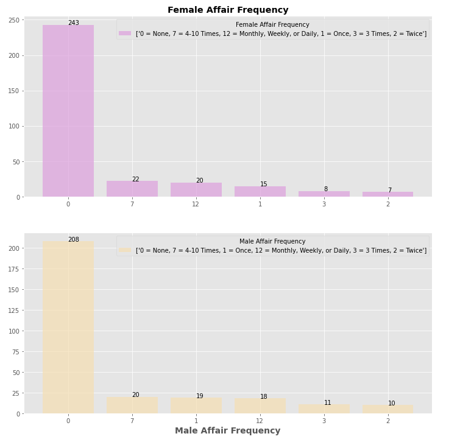
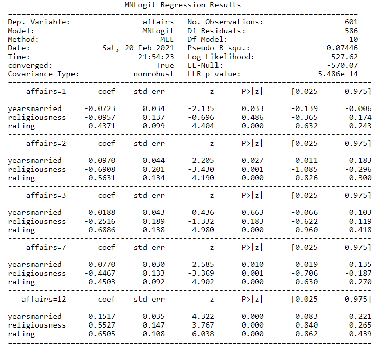

# Predictors of Marital Infidelity
 

Couples therapists view extramarital affairs as one of the most damaging relationship events and 
one of the most difficult problems to treat in couples therapy. A review of 
ethnographic accounts of conjugal dissolution across 160 societies found that infidelity was the 
single most common cause of marital dissolution (Whisman, Gordon, & Chatav, 2007). Rather than seeking couple therapy when 
extramarital affairs happen, can we predict the factors of extramarital affairs? If so, we may help 
prevent marital affairs from happening. The aim of the current case study is to determine the 
predictors of extramarital affairs. 

# Data Set
To tackle this case study, I utilized Fair’s Affair data set. It 
featured `10 columns and 601 rows`. Some notable features were frequency of affairs, gender, age, 
years married, and religiousness. After running a correlation matrix, the significant predictors 
for my model were years married, religiousness, and happiness rating. 

# Marital Happiness and Affairs

Happiness rating was categorized as 1 = very unhappy, 2 = somewhat 
unhappy, 3 = average, 4 = happier than average, and 5 = very happy. Looking at the bar plot, 
most affairs occurred with respondents whom answered in the 1 and 2 categories. The least 
affairs occurred with respondents in the 5 category. The mean for happiness rating was *M* = 3.93 
and a *SD* = 1.10.

# Affair by Sex

Affair by sex did not appear to be statistically significant between the sexes. Males had a 
mean of *M* = 1.50 affairs in the past year with a *SD* = 3.29. Females had a mean of *M* = 1.42 
affairs in the past year with a *SD* = 3.31. 

# Affair Frequency by Sex

How often the sexes engage in extramarital affairs during the past year varied 
across categories. However, overall, both sexes appeared to engage in extramarital affairs just about 
equally. 

# Multinomial Logistic Regression Model

The predictors for my model were years married, religiousness, and happiness. My target variable was affairs. I used a cross validation to partition and test the data set, since there were only 601 instances. The model achieved a mean accuracy of 74.55 %. However, the result was complex. Depending on which affair group, not all predictors were significant. For instance, the group that only had 1 affair in the past year, religiousness did not appear to be a significant predictor, but yearsmarried and happiness were significant predictors. The group who had 3 affairs in the past year, yearsmarried and religiousness did not appear to be significant predictors, but happiness rating was significant. With the exception of these two groups, every other group had all three predictors as significant.  

# Attribute of Prediction Model

Affairs start to happen six years into marriage. That is when a spouse has had one affair in the past year. Eight years into the marriage, a spouse has had three affairs in the past year. Approaching 10 years into the marriage, a spouse has had 4-10 affairs in the past year. A marriage past 10 years, a spouse has had either two affairs in the past year or once daily or weekly for the past year. 

# Conclusion

Although the model predicted years of marriage as a significant predicted of marital infidelity, we must take into account the adjusted R-squared and Fair's dataset. Years of marriage only accounts for 18% of why marital infidelity occurs. That leaves 82% unexplained. In addition, the dataset is a composition of two surveys dating 47 years and 52 years ago. It raises a question in regards to generational subjects. For instance, the survey from Psychology Today dates from 1969. The survey from Redbook dates 
from 1974. A lot has changed both in terms how people view marriage and its purpose. Perhaps 
recent studies that predict happiness rating and religiousness as predictors of infidelity used a 
sample from a more recent generation than the one used by Fair. More research is needed to 
determine if a more recent generation plays a role in predicting marital infidelity predictors. 

### Reference

Whisman, M. A., Gordon, K. C., & Chatav, Y. (2007). Predicting sexual infidelity in a population-based sample of married individuals. _Journal of Family Psychology, 21_(2), 320–324. 

##### [ GitHub Repository [Link](https://github.com/RenaissanceMan06/Marital_Infidelity) ]

