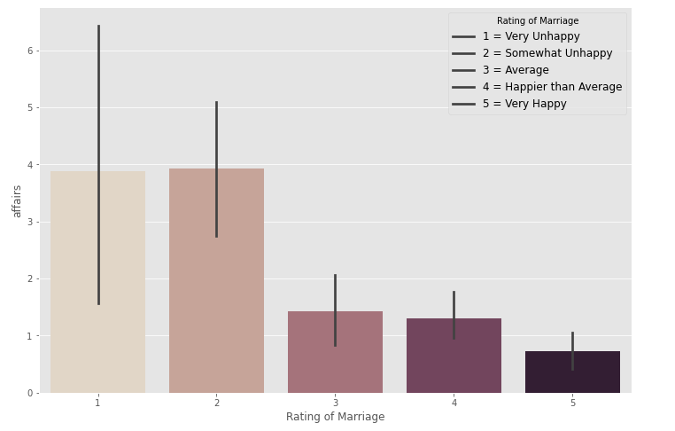

# Predictors of Marital Infidelity
 

Couples therapists view extramarital affairs as one of the most damaging relationship events and 
one of the most difficult problems to treat in couples therapy. A review of 
ethnographic accounts of conjugal dissolution across 160 societies found that infidelity was the 
single most common cause of marital dissolution (Whisman, Gordon, & Chatav, 2007). Rather than seeking couple therapy when 
extramarital affairs happen, can we predict the factors of extramarital affairs? If so, we may help 
prevent marital affairs from happening. The aim of the current case study is to determine the 
predictors of extramarital affairs. 

# Data Set
To tackle this case study, I utilized Fair’s Affair data set. It 
featured `10 columns and 601 rows`. Some notable features were frequency of affairs, gender, age, 
years married, and religiousness. After running a correlation matrix, the significant predictors 
for my model were years married, religiousness, and happiness rating. 

# Affair by Sex

Affair by sex did not appear to be statistically significant between the sexes. Males had a 
mean of *M* = 1.50 affairs in the past year with a *SD* = 3.29. Females had a mean of *M* = 1.42 
affairs in the past year with a *SD* = 3.31. 

# Affair Frequency by Sex

How often the sexes engage in extramarital affairs during the past year varied 
across categories. However, overall, both sexes appeared to engage in extramarital affairs just about 
equally. 

# Multinomial Logistic Regression Model

Since the target vector had a highly imbalanced classes, I had to upsample the subset for my model. The initial data set contained `601 rows` and the upsampled data set contained `2706 rows`. The additional rows gave me a balanced target vector.   

The predictors for my model were years married, religiousness, and happiness. My target variable was affairs. I used a cross validation to partition and test my model. The model achieved a `mean accuracy of 31.93 %` with a `SD = 2.94 ± % `. However, the result was complex. Depending on the affair group, not all predictors were significant. For instance, the group that only had 1 affair in the past year, happiness rating did not appear to be a significant predictor, but yearsmarried and religiousness were significant predictors. The group who had 3 affairs in the past year, religiousness did not appear to be a significant predictor, but happiness rating and yearsmarried were significant. With the exception of these two groups, every other group had all three predictors as significant.  

I also performed a split validation to test its accuracy. It had an accuracy of `33.00 %`. Both recall and precision score were `33.00 %` respectively.

# Attributes of Prediction Model

## Yearsmarried

Affairs start to happen six years into marriage. That is when a spouse has had one affair in the past year. Eight years into the marriage, a spouse has had three affairs in the past year. Approaching 10 years into the marriage, a spouse has had 4-10 affairs in the past year. A marriage past 10 years, a spouse has had either two affairs in the past year or once daily or weekly for the past year. 

## Happiness Rating

Happiness rating was categorized as 1 = very unhappy, 2 = somewhat unhappy, 3 = average, 4 = happier than average, and 5 = very happy. Looking at the bar plot, most affairs occurred with respondents whom answered in the 1 and 2 categories. The least affairs occurred with respondents in the 5 category. The mean for happiness rating was *M* = 3.93 and a *SD* = 1.10.

## Religiousness

People who didn't identify as religious engaged in more affairs than people whom identified as religious. 

# Conclusion

Although the multinomial logistic regression results predicted yearsmarried, religiousness, and happiness rating as significant factors of marital infidelity, its accuracy at predicting was rather low. Only 1 out 3 predictions is correct. 

We might have heard of the proverb that says, "The grass isn't greener on the other side." This might true. The grass is greener where you water it and nurture it. 

### Reference

Whisman, M. A., Gordon, K. C., & Chatav, Y. (2007). Predicting sexual infidelity in a population-based sample of married individuals. _Journal of Family Psychology, 21_(2), 320–324. 

##### [ GitHub Repository [Link](https://github.com/RenaissanceMan06/Marital_Infidelity) ]

